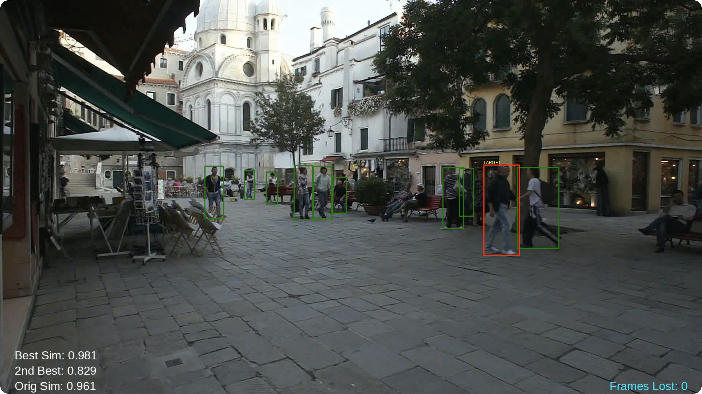
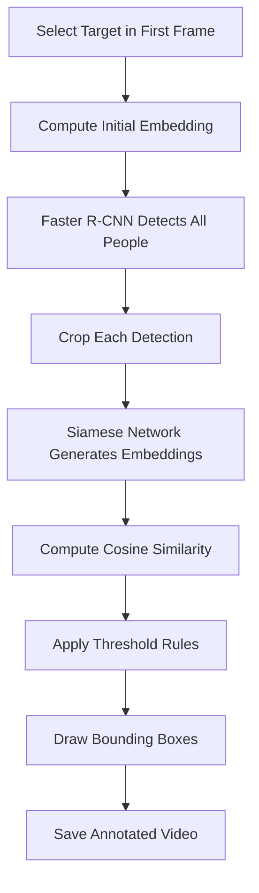

# Deep Learning Single Pedestrian Target Tracking

Track a single pedestrian across an entire video using object detection and person re-identification.

    
<b>MOT16-01 Test Video Screenshot</b>

    

  

    
<b>MOT16-07 Test Video Screenshot</b>

    

## Overview

This project combines two deep learning models to track one selected pedestrian through every frame of a video.

- **Faster R-CNN** detects all people in each frame.
- **Siamese Network** compares each detected person to the selected target.
- **Cosine Similarity and Heuristic Rules** determine the best match.
- **OpenCV** renders bounding boxes and tracking statistics into a final MP4 video.

The system is designed to handle:

- Crowded scenes
- Similar-looking pedestrians
- Temporary occlusions
- Targets leaving and re-entering the frame

## Example Output

The tracker performs the following steps:

1. Selects a target in the first frame.
2. Detects all pedestrians in each subsequent frame.
3. Extracts embeddings for each detection.
4. Computes similarity scores to the target.
5. Selects the best candidate.
6. Updates the target representation over time.
7. Draws a red bounding box labeled `TARGET`.

All other detected pedestrians are shown with green bounding boxes. The target is shown with a red bounding box and label.

## Pipeline Architecture

## Models Used

### Faster R-CNN Detector

- Model: `fasterrcnn_resnet50_fpn`
- Framework: PyTorch and TorchVision
- Pretrained on the COCO dataset
- Fine-tuned on the MOT16 dataset
- Detects pedestrians in each frame

### Siamese Re-Identification Network

- Custom CNN architecture
- Trained using Triplet Margin Loss
- Generates feature embeddings for person crops
- Compares identities using cosine similarity

## Datasets

### MOT16

Used to fine-tune the pedestrian detector and evaluate tracking performance.

### Market-1501

Used to train the Siamese network for person re-identification.

## Training Highlights

### Detector Training

- Binary classification: background vs person
- 80/20 train-validation split within each video
- Visibility filter: only pedestrians with more than 25% visibility
- Early stopping
- Learning rate finder
- Optuna hyperparameter optimization

### Siamese Training

- Triplet sampling (anchor, positive, negative)
- Data augmentation:
  - Random horizontal flip
  - Color jitter
- Evaluation using ROC AUC

## Tracking Logic

For each frame:

1. Detect all pedestrians with Faster R-CNN.
2. Extract embeddings for each detection.
3. Compute cosine similarity to:
   - The previous target embedding
   - The original target embedding
   - Ensure seperation between calculated similarity of best and second best target candidates
4. Select the best candidate if all thresholds are satisfied.

## Results

### Faster R-CNN

- Best model found at epoch 6
- Training loss: 0.366
- Validation loss: 0.465
- Early stopping at epoch 11

### Siamese Network

- Best model saved at epoch 30
- ROC AUC greater than 0.95
- Top-1 Accuracy: 78.2%

### Tracking Performance

- Successfully tracked a selected pedestrian through full videos
- Re-identified the target after temporary occlusion
- Avoided false target switching in crowded scenes

## Experimental Techniques Explored

Several advanced methods were tested during development but were not included in the final pipeline:

- DeepSORT with custom embeddings
- Hungarian assignment using IoU and Re-ID cost matrices
- Batch-Hard Triplet Mining
- Multi-task classification and triplet loss
- OneCycleLR learning rate scheduling

The final implementation favored simplicity and strong empirical performance.

## Tech Stack

- Python
- PyTorch
- TorchVision
- OpenCV
- Optuna
- NumPy
- SciPy
- Matplotlib

## Future Improvements

- Real-time inference using lightweight detectors such as YOLO
- Multi-target tracking
- Multi-camera re-identification
- GUI for uploading videos
- Full MOT metrics including MOTA and IDF1

## Skills Demonstrated

- Computer Vision
- Deep Learning
- Transfer Learning
- Metric Learning
- Hyperparameter Optimization
- Video Processing
- Model Evaluation
- Python Development
